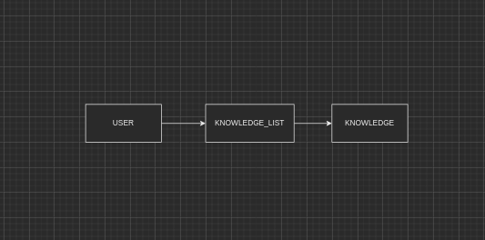
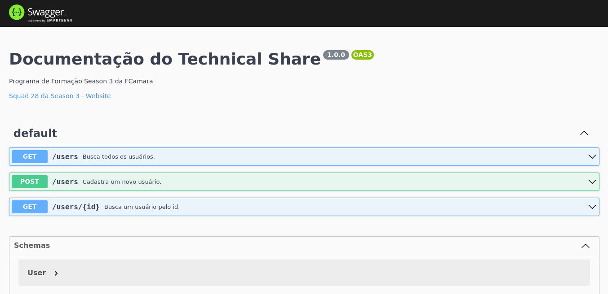
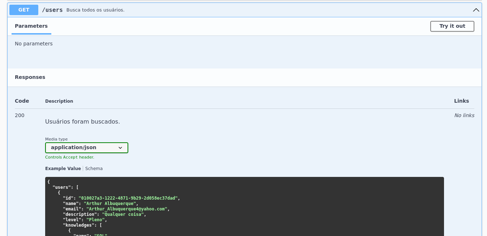
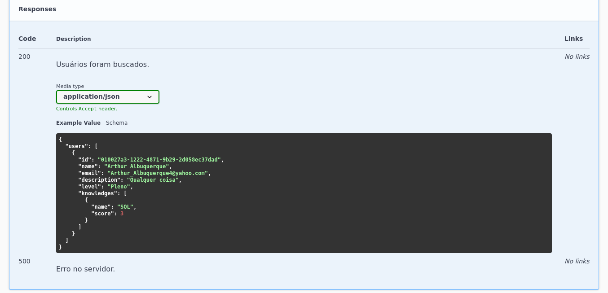
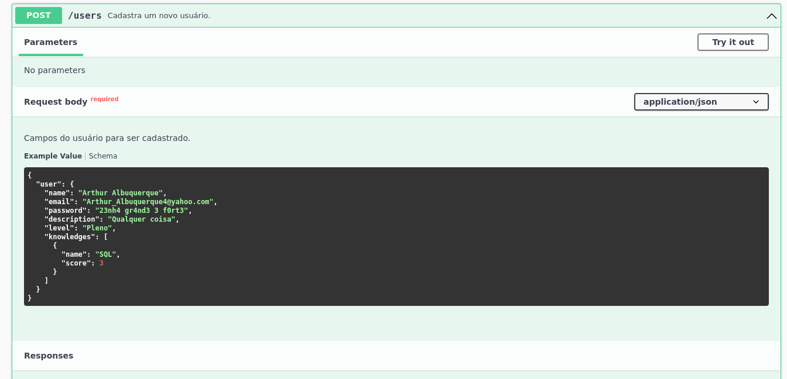
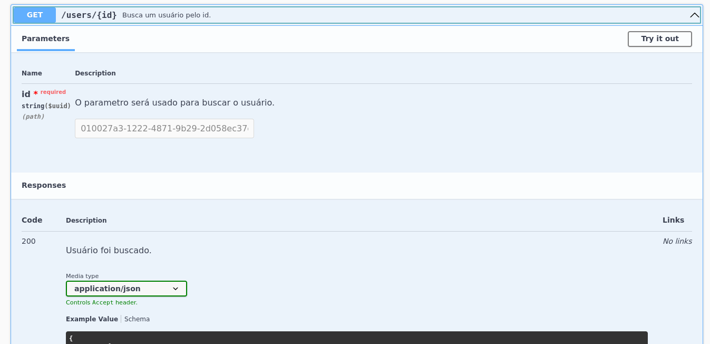
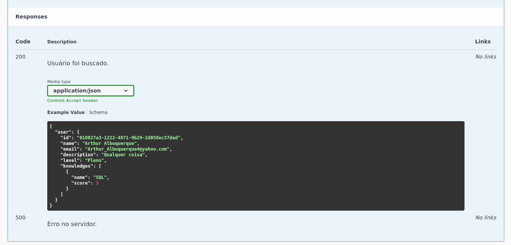
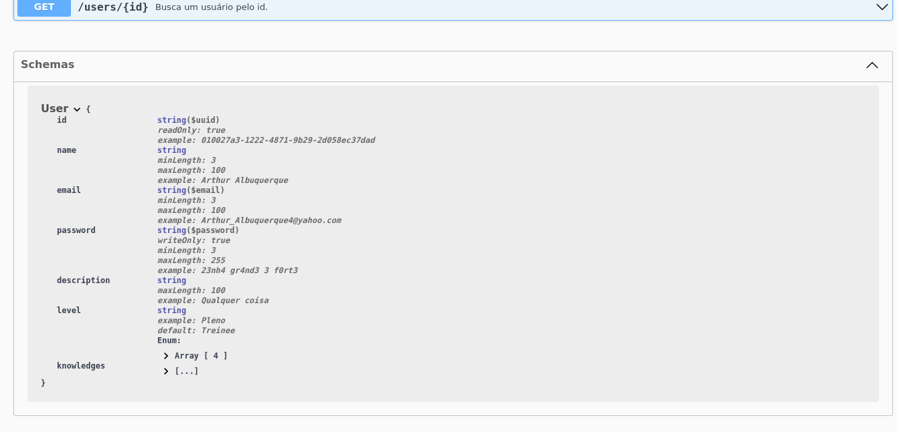

# Squad 28 Technical Share

> Os comandos SQL, diagramas e etc, estão no diretório `docs`.

> Para a visualização do diagrama, instale a extensão [Draw.io Integration](https://marketplace.visualstudio.com/items?itemName=hediet.vscode-drawio) do vscode ou abra a imagem.

## Sobre o projeto

Technical Share é uma API com o objetivo de facilitar o encontro entre pessoas com conhecimentos específicos e para ter uma possível comunicação (através do campo de email) para tirar dúvidas, ter troca de conhecimentos.

O projeto foi desenvolvido em 15 dias no Hackathon da FCamara.

[Link para o backend em produção](https://squad-28-technical-share.herokuapp.com/api-docs)

[Repositório do backend](https://github.com/Squad-28/back-end)

[Repositório do frontend](https://github.com/Squad-28/front-end)

[Artigo sobre o projeto](https://medium.com/@squad28.hackathon/technical-share-site-responsivo-para-coopera%C3%A7%C3%A3o-entre-colaboradores-da-fcamara-6664b6804e58)

[Protótipo de Baixa Fidelidade](https://www.figma.com/proto/4oqadBJ4b4SAcZEqFVsGqH/Squad-28---Arquivo-principal?page-id=110%3A2971&node-id=350%3A3683&viewport=340%2C48%2C0.05&scaling=min-zoom&starting-point-node-id=350%3A3683&show-proto-sidebar=1)

[Protótipo de Alta Fidelidade](https://www.figma.com/proto/4oqadBJ4b4SAcZEqFVsGqH/Squad-28---Arquivo-principal?node-id=609%3A11361&scaling=scale-down&page-id=557%3A4359&starting-point-node-id=609%3A11361)

[Wireframes de Baixa Fidelidade](https://www.figma.com/file/4oqadBJ4b4SAcZEqFVsGqH/Squad-28---Arquivo-principal?node-id=110%3A2971)

[Wireframes de Alta Fidelidade](https://www.figma.com/file/4oqadBJ4b4SAcZEqFVsGqH/Squad-28---Arquivo-principal?node-id=557%3A4359)

## Funcionalidades

### Desenvolvido

- Rota `GET /users` para buscar todos os usuários cadastrados.
- Rota `GET /users/:id` para buscar um usuário cadastrado pelo id.
- Rota `POST /users` para cadastrar um usuário.
- Rota `/api-docs` para visualizar a documentação com Swagger.

### Não deu para ser desenvolvido

- Login com JWT.
- Validação dos dados recebidos.

## Sumario

- [Sobre a API](#sobre-o-projeto)
- [Funcionalidades](#funcionalidades)
  - [Desenvolvido](#desenvolvido)
  - [Não deu para ser desenvolvido](#não-deu-para-ser-desenvolvido)
- [Como usar localmente](#como-usar-localmente)
  - [Rodando o projeto sem Docker](#rodando-o-projeto-sem-docker)
  - [Rodando o projeto com Docker](#rodando-o-projeto-com-docker)
  - [Rodando os testes](#rodando-os-testes)
- [Tecnologias e ferramentas usadas](#tecnologias-e-ferramentas-usadas)
- [Sobre a jornada](#sobre-a-jornada)
  - [Dificuldades encontradas](#dificuldades-encontradas)
  - [Aprendizados](#aprendizados)
- [Documentos](#documentos)
- [Screenshots](#screenshots)
- [Time](#time)
  - [Fullstack](#fullstack)
  - [UX](#ux)

## Como usar localmente

[Ir para o sumário](#sumario)

### Rodando o projeto sem docker

- `yarn yarn --frozen-lockfile`.
- no arquivo `.env.example` coloque as credenciais do seu banco.
- renomeie de `.env.example` para `.env`.
- crie o banco de dados `squad_28_technical_share`.
  - `CREATE DATABASE squad_28_technical_share; USE squad_28_technical_share;`.
- `yarn dev`.
- abra o navegador e digite na url `http://localhost:3333/api-docs`.

### Rodando o projeto com docker

- `/bin/bash run-init.sh`.
- abra o navegador e digite na url `http://localhost:3333/api-docs`.
- para rodar somente o backend `docker-compose exec backend yarn dev`.
- caso queira rodar o phpmyadmin.
  - `docker-compose -f dc.phpmyadmin.yml up -d`.

### Rodando os testes

- `yarn test`

## Tecnologias e ferramentas usadas

[Ir para o sumário](#sumario)

- Node.js, MySQL, Express e Sequelize.
- Docker e Docker Compose para teste local.
- Pipeline CI/CD com GitHub Actions para testar e fazer deploy no Heroku.
- Hospedagem no Heroku e provisionamento do banco de dados MySQL com ClearDB.
- Testes automatizados com Jest e SQLite.
- Documentação da API Rest com Swagger.
- Pretty e Editorconfig para padronizar código.

## Sobre a Jornada

[Ir para o sumário](#sumario)

### Dificuldades encontradas

- Configuração inicial.
- Organização de tarefas para cada uma pessoa.
- Trabalhar em conjunto com o time de UX, frontend e backend.
- Padronizar os dados que serão trocados entre frontend e backend para tirar a dependência de ambos e o time do frontend conseguir trabalhar independente do que o time do backend está fazendo.
- Modelar a ideia do banco de dados, das rotas do backend e as funcionalidade.

### Aprendizados

- Trabalhar em equipe e como organizar o que cada um irá fazer.
- Muita comunicação para estar sempre atualizado do que cada um está fazendo.
- Uso do git em equipe, trabalhando com branches e lidando com conflitos de merge.
- Tecnologias aprendidas.

## Documentos

[Ir para o sumário](#sumario)

Tabelas do banco

## Screenshots

[Ir para o sumário](#sumario)

## Time

[Ir para o sumário](#sumario)

### Fullstack

- Lucas Morais
  - [GitHub](https://github.com/LucasMorais1998)
  - [Linkedin](https://www.linkedin.com/in/lucas-morais-santos/)
- Pablo Henrique
  - [GitHub](https://github.com/Pablohenrique2)
  - [Linkedin](https://www.linkedin.com/in/pablo-henrique-832445203)
- Rafael Borges
  - [GitHub](https://github.com/okborges)
  - [Linkedin](https://www.linkedin.com/in/okborges)
- Sérgio Deiró
  - [GitHub](https://github.com/felippedesouza)
  - [Linkedin](https://www.linkedin.com/in/sergiofelippe-deiro)

### UX

- Anne Karoline Fortunato do Carmo
  - [GitHub](https://github.com/annekarolinefc)
  - [Linkedin](https://www.linkedin.com/in/annekarolinefc/)
- Matheus Donato
  - [Linkedin]()
- Millena Cruz
  - [GitHub]()
  - [Linkedin]()
